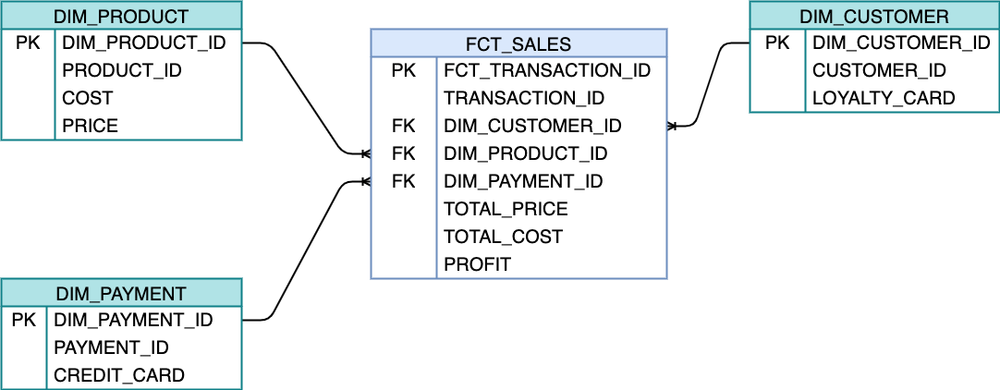

# DEMO DWH SALES


## Business Requirements
The business needs to keep track the amount of product sold in the past year.

## Getting Started

1. create a Docker image that contains Postgres and PgAdmin
2. run from terminal
```yaml
docker-compose up -d
```


## Data Flow
The data source is static: CSV file.
The steps to follow:
1. ingest the CSV file into the raw table
2. model the data into the star schema: fct_sales, ...


## Conceptual Diagram


## Logical Model
1. business understanding: the business needs to keep track the amount of product sold in order to improve the supply chain strategy
2. declare the grain: one row identifies one transaction 
3. identify the dimensions: product, customer, payment method
4. identify the facts (measurements): total_price, total cost, profit



